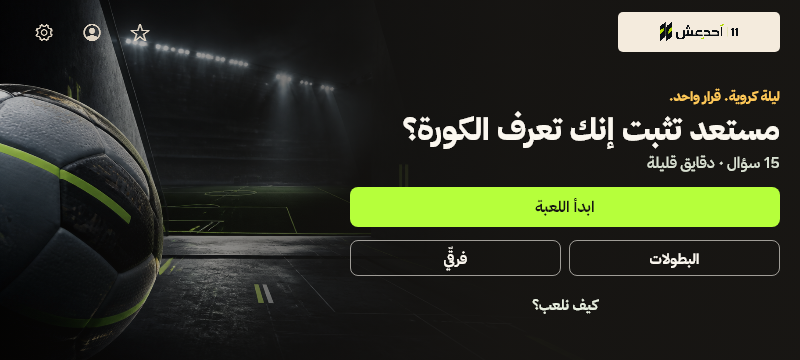
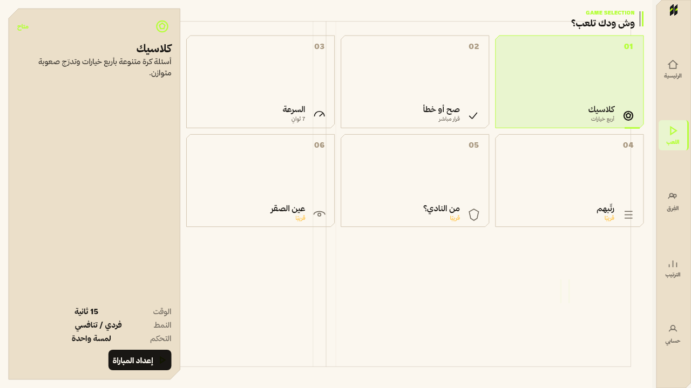
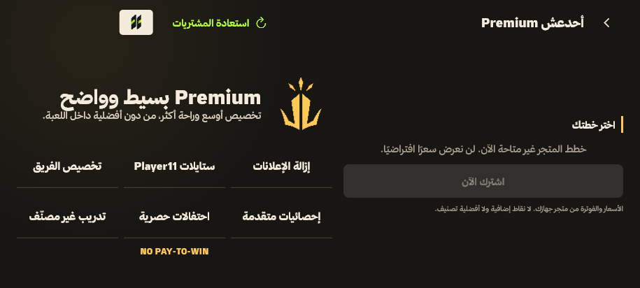

# أحدعش 11 — مقارنة واجهة اللعبة قبل V2 وبعدها

تاريخ التوثيق: 2026-08-29 (Asia/Riyadh).

## النتيجة المختصرة

أصبح اتجاه V2 أقرب إلى سطح لعبة مستمر: Dock جانبي، مناطق معلومات واضحة، أسطح ذات زوايا مقصوصة، وتسلسل بصري يقدّم اللعب والحالة والإجراء الأساسي قبل التفاصيل. المقارنة التاريخية القابلة للإثبات بالصور تقتصر على **Home وPlay وPremium في Landscape**: عشر لقطات لكل شاشة، موزعة على خمسة مقاسات وثيمين، أي **30 زوجًا فعليًا قبل/بعد**.

لا تُستخدم صور Portrait القديمة لإثبات إعادة تصميم V2، ولا تُختلق لقطات «قبل» للشاشات التي لم يُحفظ لها baseline. نتيجة الاختبار التفصيلية موثقة في [تقرير Golden V2](golden-v2-report.md).

## مصدر القرار

سبق [بحث إعادة تصميم واجهة اللعبة V2](game-ui-redesign-v2-research.md) التنفيذ، وحدد المبادئ الآتية:

- سطح لعبة مستمر بدل صفحة business أو مجموعة Cards متشابهة.
- `GamePanel` و`HudStrip` و`GameSelectionTile` ومكونات حالة ذات زوايا مقصوصة وإيقاع اتجاهي.
- Dock جانبي مضغوط، مع ظهور النص عندما تسمح المساحة.
- Typography كثيفة وواضحة، مع أولوية للسؤال والنتيجة والإجراء الأساسي.
- تركيب طبيعي بلا تمرير في المقاسات المستهدفة، وتمرير احتياطي عند تكبير النص أو ضيق المساحة.
- Lime للحالة النشطة وCTA والنتيجة والتقدم، وSand/Gold للتنبيه والرتبة.

اللقطات تثبت الشكل الثابت لهذه المبادئ في الحالات المجمدة فقط؛ ولا تثبت وحدها دلالات الوصول، أو قياس أهداف اللمس، أو الحركة، أو الأداء على جهاز.

## حدود أرشيف «قبل»

يحتوي `visual-validation/before-v2` على 60 PNG:

| المجموعة | الشاشات | المقاسات | الثيمات | العدد | صلاحية المقارنة مع V2 |
|---|---|---|---|---:|---|
| Landscape | Home، Play، Premium | 800×360، 844×390، 915×412، 1280×720، 1366×768 | Light/Dark | 30 | مقارنة فعلية؛ كل اسم له Golden V2 مقابلة |
| Portrait legacy | Home، Play، Store، Product، Wallet | 360×800، 390×844، 412×915 | Light/Dark | 30 | أرشيف مرحلة أقدم، وغير مستدعى من اختبار V2 الحالي |

كل اللقطات الثلاثين الخاصة بـLandscape تغيّر محتواها مقارنة بالـGolden الحالية. أما أزواج Portrait الثلاثون فبقيت مطابقة للـbaseline، ولذلك لا تُحسب كدليل على تغيير V2.

## Home

قبل V2 كانت الشاشة مبنية من Hero وبطاقات كبيرة منفصلة حول الملف والتحدي وأنواع اللعب. بعد V2 صار السطح أكثر اتصالًا: شريط هوية وحالة، لوحة لعب مركزية، مناطق تحدي وترتيب، وشريط أنواع لعب مرقم داخل نفس الإيقاع البصري.

| قبل V2 | Golden V2 الحالي |
|---|---|
|  |  |

التغيير المثبت بصريًا:

- الإجراء الأساسي «العب الحين» بقي ظاهرًا، لكنه صار جزءًا من Game Panel بدل بطاقة مستديرة مستقلة.
- معلومات الفريق والتحدي والترتيب أعيد توزيعها إلى مناطق أقصر وأكثر مباشرة.
- Dock الجانبي والحالة النشطة يتبعان نظام Lime المحدد في البحث.
- الخلفية والهندسة تربطان المناطق بدل الاعتماد على Poster كبير.

## Play

قبل V2 اعتمد Play على صور Hero وبطاقات Mode مصورة كبيرة. بعد V2 أصبحت Game Selection منظمة في شبكة 3×2 مرقمة، مع لوحة إعداد جانبية وحالة صريحة للمودات المتاحة والقريبة.

| قبل V2 | Golden V2 الحالي |
|---|---|
|  |  |

التغيير المثبت بصريًا:

- الانتقال من Poster-led hierarchy إلى اختيار Mode مباشر ومنظم.
- Classic وTrue/False وSpeed ظاهرة كوحدات متمايزة، والمودات غير المكتملة موسومة «قريبًا».
- الإعداد المختار يظهر في Side Panel منفصل، بدل خلط نوع اللعبة وصيغة المباراة في البطاقة نفسها.
- في العرض الواسع تظهر تسميات الـDock؛ وفي العرض المضغوط تبقى الرموز فقط.

## Premium

قبل V2 كانت المزايا موزعة كعناصر منفصلة مع مساحة فارغة كبيرة وهوية Premium نصية. بعد V2 أصبحت الشاشة ثلاثة أقاليم واضحة: بطاقة هوية Premium، شبكة مزايا، ولوحة خطة وCTA.

| قبل V2 | Golden V2 الحالي |
|---|---|
|  |  |

التغيير المثبت بصريًا:

- هوية اللاعب وعبارة `NO PAY-TO-WIN` أصبحتا عنصرًا بصريًا مستقلًا.
- المزايا جُمعت في Grid قصيرة بدل Chips متفرقة.
- حالة عدم توفر خطط المتجر تظهر بوضوح، ولا يعرض الـfixture سعرًا افتراضيًا أو نجاح شراء مصطنعًا.
- Gold/Sand محصوران في هوية Premium، بينما Lime يبقى للحالة والإجراء.

## شاشات V2 بلا baseline محفوظ

توجد 70 Golden حالية لسبع شاشات، عشر لقطات لكل شاشة، ولكن لا توجد لها صور `before-v2`:

| الشاشة | عدد Golden الحالية | ما يمكن قوله بدقة |
|---|---:|---|
| Question | 10 | تغطية الحالة المجمدة الحالية فقط |
| Results | 10 | تغطية الحالة المجمدة الحالية فقط |
| Teams | 10 | تغطية Fariq Hub الحالية فقط، لا Team Detail |
| Profile | 10 | تغطية Player Card الحالية فقط |
| Settings | 10 | تغطية قسم الحساب الافتراضي فقط |
| Login | 10 | تغطية حالة نموذج الدخول الافتراضية فقط |
| Club Picker | 10 | تغطية حالة اختيار الدوري/النادي المجمدة فقط |

هذه المجموعة توثّق شكل V2 الحالي، لكنها **ليست** دليل before/after. لا يوجد تاريخ Git أو لقطة baseline صالحة تسمح بإعادة بناء «قبل» دون اختلاق دليل.

## ما لا يدخل في مقارنة V2

- ملفات Portrait لـStore وProduct وWallet، وPortrait الإضافية لـHome وPlay، موجودة كـlegacy ولا يستدعيها الـharness الحالي.
- Ranking وGame Setup وOnboarding وOnline Match وRoom/Online Lobby وTeam Detail ليست ضمن مصفوفة Golden V2 الحالية.
- لقطة واحدة لكل حالة لا تثبت loading/error/empty/reconnect أو كل الاختيارات والنصوص الطويلة.
- الـGolden لا تثبت 4:3 أو 16:10 أو safe insets أو text scale الكبير؛ المقاسات الفعلية موثقة في التقرير.
- الـGolden لا تثبت FPS أو startup أو الذاكرة أو ANR أو Google Sign-In أو RevenueCat أو FCM أو Supabase live flows.

## خلاصة المقارنة

المقارنة المدعومة بالأدلة هي **30/30 زوج Landscape متغيرًا** لـHome وPlay وPremium. أما بقية مصفوفة V2 فهي current-only، واللقطات الثلاثون القديمة خارج المصفوفة تبقى legacy ولا يجوز ضمها إلى نتيجة V2 أو وصفها بأنها أعيد تصميمها.
